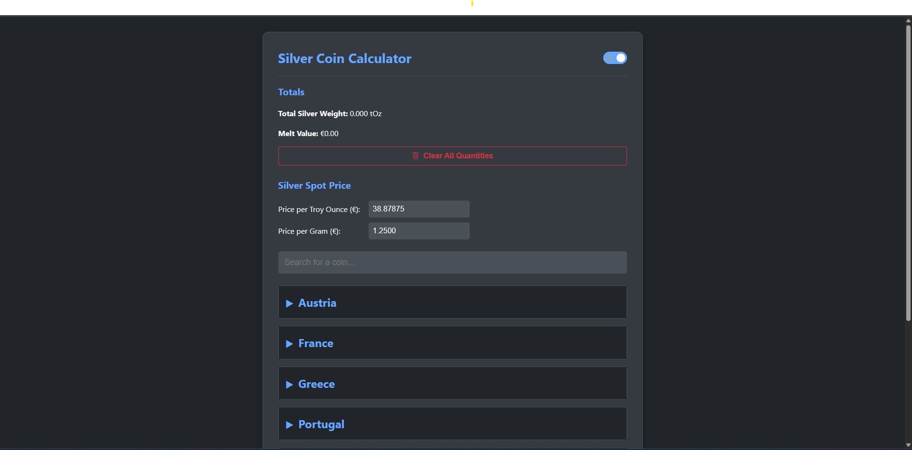

# Silver Coin Calculator

A dynamic, client-side web application for calculating the total silver weight and melt value of a coin collection. The application is managed entirely through a simple CSV file, making it easy to add, update, and manage your coin list without touching the code.


*(To add a screenshot, take a picture of the running application and save it as `screenshot.png` in the project directory.)*

---

## ✨ Features

- **Dynamic Coin Loading**: The entire coin list is loaded from an external `coins.csv` file.
- **Real-time Calculations**: Total silver weight and melt value are calculated instantly as you input quantities.
- **Individual Subtotals**: See the melt value for each row of coins as you enter quantities.
- **Editable Spot Price**: Manually enter the current price of silver per troy ounce or per gram.
- **Collapsible UI**: Coins are grouped by country in clean, foldable sections for easy navigation.
- **Advanced Search**: A powerful search bar filters coins and countries in real-time, supporting multi-keyword searches (e.g., "UK Shilling").
- **Persistent State**: Your entered coin quantities are automatically saved in the browser's local storage, so they're there when you return.
- **Dark & Light Themes**: Includes a sleek theme switcher with sun/moon icons. The app also detects your system's preferred theme on the first visit.
- **Robust Error Handling**:
  - **CSV Validation**: Checks `coins.csv` for invalid data (e.g., negative weights, incorrect columns) and displays clear warnings without crashing.
  - **Precision Validation**: Enforces that all `silverWeight` values in the CSV have at least 6 decimal places.
  - **Input Validation**: Prevents negative values from being entered for prices or quantities.
- **Utility Features**: A "Clear All" button with a confirmation prompt to reset all quantities.

---

## 🛠️ Tech Stack

- **Frontend**: HTML, CSS, Vanilla JavaScript (no frameworks or libraries).
- **Data Source**: A local `coins.csv` file.

---

## 📂 Project Structure

The project is self-contained. All files should be in the same directory.  
/silver-coin-calculator/  
├── index.html # The main HTML structure  
├── style.css # All styling, including themes  
├── script.js # All application logic and functionality  
└── coins.csv # Your personal coin database  

---

## 🚀 Setup and Installation

Because modern browsers restrict local file access for security reasons, you cannot simply open `index.html` directly. The project must be served by a local web server. The easiest way to do this is with Python.

1.  **Download Files**: Place `index.html`, `style.css`, `script.js`, and `coins.csv` in a single folder.

2.  **Populate Your Data**: Open `coins.csv` with a text editor or spreadsheet program and add your coin data. See the **Data Format** section below for details.

3.  **Start a Local Server**:
    - Open a terminal or command prompt.
    - Navigate to the project folder where you saved the files.
    - If you have Python 3 installed, run the following command:
      ```bash
      python -m http.server
      ```
    - This will start a local server, usually on port 8000.

4.  **Open the Application**:
    - Open your web browser (Chrome, Firefox, etc.).
    - Go to the address: `http://localhost:8000`
    - The Silver Coin Calculator should now be running.

---

## 📖 How to Use

1.  **Update Spot Price**: If necessary, change the values in the "Silver Spot Price" section. The per-gram and per-ounce prices will stay in sync.
2.  **Find Your Coins**: Use the search bar to filter the list or click on a country name to expand its section.
3.  **Enter Quantities**: In the input box next to each coin, enter the quantity you own.
4.  **View Totals**: The **Totals** section at the top will update instantly, along with the individual subtotal for that coin row.
5.  **Change Theme**: Use the toggle switch in the header to switch between light and dark modes.
6.  **Clear Data**: Click the "Clear All Quantities" button to reset all inputs to zero.

---

## 📊 Data Format (`coins.csv`)

This file is the heart of your application. It must follow a specific format.

- The first line **must** be the header: `country,name,date,silverWeight`
- Each subsequent line represents a single type of coin.

#### Column Descriptions:

| Column         | Description                                                                                             | Example                        | Validation Rules                                         |
|----------------|---------------------------------------------------------------------------------------------------------|--------------------------------|----------------------------------------------------------|
| `country`      | The country of origin. Used for grouping.                                                               | `USA`                          | Required.                                                |
| `name`         | The name of the coin. If the name includes a comma, it **must** be enclosed in double quotes.            | `Morgan Silver Dollar` or `"Florin, Circulated"` | Required.                                                |
| `date`         | The year or date range of the coin. This is treated as text.                                            | `1916-1945`                    | Required.                                                |
| `silverWeight` | The silver weight of a single coin in Troy Ounces (tOz).                                                | `0.773450`                     | **Required**. Must be a non-negative number. **Must have at least 6 decimal places for precision.** |

**Example of Valid `coins.csv` content:**
```csv
country,name,date,silverWeight
USA,Morgan Silver Dollar,1878-1921,0.773450
USA,Peace Silver Dollar,1921-1935,0.773450
UK,"Shilling, 92.5% Silver",1902-1919,0.168200

---

## ⚖️ Disclaimer

> This application is for informational and educational purposes only. The calculations are based on user-provided data (silver spot price and coin data in `coins.csv`) and are intended as estimates.
>
> The spot price of silver is volatile and fluctuates constantly. The prices used in this calculator may not be real-time or accurate. All data, especially the silver weights in the `coins.csv` file, should be independently verified by the user.
>
> The author and contributors are not liable for any errors, inaccuracies, financial losses, or damages of any kind resulting from the use of this software. **Use at your own risk.**